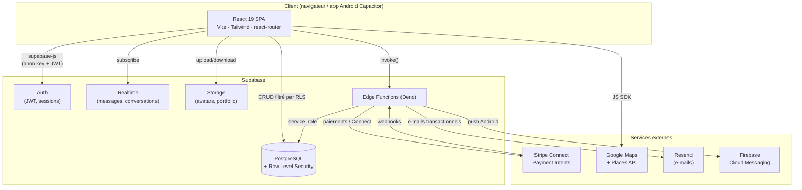
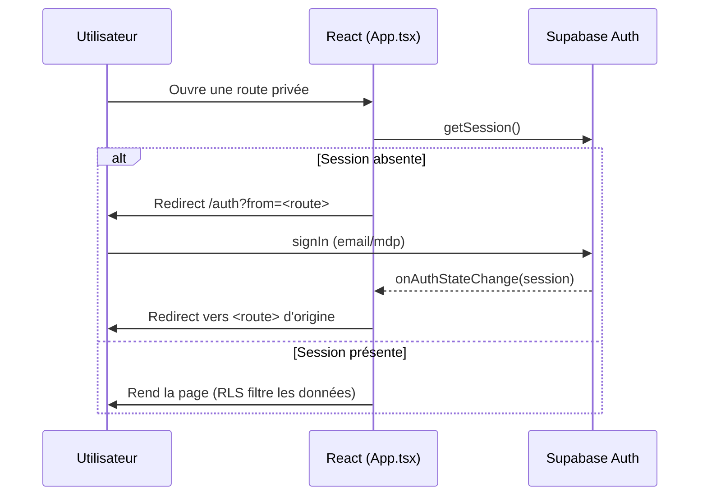
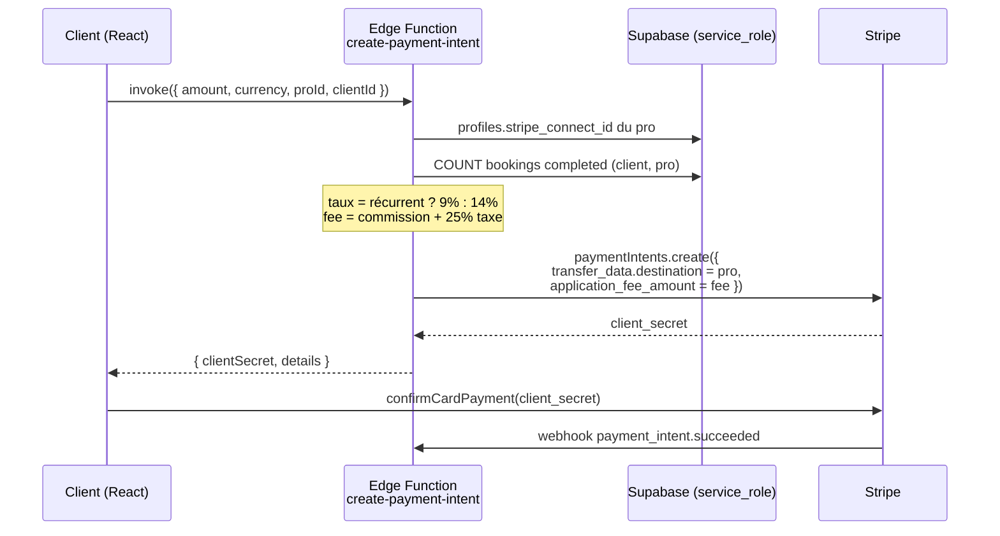

# Architecture — AlloLokal

Ce document décrit l'architecture technique d'AlloLokal : les couches, leurs responsabilités, et les flux critiques (authentification, paiement avec commission, messagerie temps réel).

---

## 1. Vue d'ensemble

AlloLokal est une **SPA React** servie statiquement, adossée à **Supabase** (BaaS) pour la base de données, l'authentification, le temps réel et le stockage. La logique serveur sensible (paiements, e-mails, suppression de compte) est déportée dans des **Edge Functions Deno**. Le même code React est empaqueté par **Capacitor** en application Android native.

---

## 2. Les couches

### 2.1 Front-end (`src/`)

- **React 19 + TypeScript**, bundlé par **Vite 8**.
- **Routing** (`src/App.tsx`) : `react-router-dom` 7 avec *lazy loading* de quasiment toutes les pages (`React.lazy` + `Suspense`) pour réduire le bundle initial. Seule la `Home` est importée en *eager*.
- **Gestion de session** : `App.tsx` s'abonne à `supabase.auth.onAuthStateChange` et expose la `session` par props. Un délai de secours de 5 s débloque l'UI si Supabase ne répond pas.
- **Contrôle d'accès UI** :
  - `PrivateRoute` redirige vers `/auth` si pas de session (avec paramètre `?from=` pour revenir après login).
  - Le **panel admin** est monté sur `/<VITE_ADMIN_SLUG>` et n'est rendu que si `session.user.app_metadata.role === 'admin'`.
- **State** : local (hooks React) + Contexts (`ThemeContext`). Pas de store global type Redux.
- **i18n** : `i18next` avec détection de langue navigateur ; locales `fr`, `en`, `de`, `hr`.
- **Natif** : `useIsNative`, `BottomTabBar`, bouton retour Android, confirmations Material, bannière d'opt-in notifications — activés quand l'app tourne sous Capacitor.

### 2.2 Backend — Supabase

- **PostgreSQL** avec **Row Level Security** sur toutes les tables applicatives : le front utilise la clé `anon` et n'accède qu'aux lignes autorisées par les policies (voir [DATABASE.md](DATABASE.md)).
- **Auth** : e-mail/mot de passe. Le rôle `admin` est porté par `app_metadata.role` dans le JWT.
- **Realtime** : réplication activée sur `messages` et `conversations` pour la messagerie instantanée et le badge de non-lus.
- **Storage** : buckets `avatars` et `portfolio`.
- **Fonctions Postgres** (RPC) : recherche par distance et disponibilités (`get_services_with_distance`, `get_next_available_dates`, `get_available_pro_ids_in_range`), triggers (e-mail de bienvenue, mise en pause sur litige, `last_message` de conversation).

### 2.3 Edge Functions (`supabase/functions/`)

Fonctions Deno pour tout ce qui exige un **secret serveur** ou des **privilèges élevés** (`service_role`). Elles couvrent : création de Payment Intents et de comptes Connect, abonnements, webhooks Stripe, e-mails transactionnels (Resend), push (FCM), finalisation d'inscription et suppression de compte. Contrat détaillé dans [API.md](API.md).

### 2.4 Services externes

- **Stripe Connect (Express)** : chaque pro possède un compte connecté (`stripe_connect_id`). Les paiements clients sont routés vers le pro avec une **commission de plateforme** prélevée en `application_fee_amount`.
- **Google Maps / Places (New)** : carte, géolocalisation, autocomplétion de ville. Quotas côté client (`src/lib/mapsQuota.ts`).
- **Resend** : e-mails transactionnels (réservation, statut, litige, bienvenue, récap mensuel).
- **FCM** : notifications push Android.

---

## 3. Flux critiques

### 3.1 Authentification & routes protégées

### 3.2 Paiement d'une prestation avec commission

Le taux de commission dépend de la relation client↔pro : **14 %** pour une première prestation, **9 %** pour un client récurrent (déjà une réservation `completed` avec ce pro). Une taxe de 25 % est appliquée sur la commission. Le calcul se fait **côté serveur** dans l'Edge Function (jamais côté client).

### 3.3 Onboarding pro (Stripe Connect)

Le pro déclenche `create-connected-account` → un compte Stripe **Express** (pays `HR`) est créé, l'utilisateur complète l'onboarding sur Stripe, puis le webhook `account.updated` passe `profiles.onboarding_complete = true` dès que `charges_enabled`.

### 3.4 Messagerie temps réel

`conversations` (unique par couple client/pro) + `messages`, avec RLS restreignant l'accès aux deux participants. Le front s'abonne au canal Realtime ; un trigger met à jour `last_message`/`last_message_at`. Le hook `useUnreadMessages` alimente le badge de non-lus.

---

## 4. Décisions structurantes

| Décision                              | Motivation                                                                 |
| ------------------------------------- | -------------------------------------------------------------------------- |
| Supabase (BaaS) plutôt qu'API maison  | Time-to-market, RLS, Auth, Realtime et Storage intégrés                     |
| RLS comme couche d'autorisation       | La sécurité vit dans la base ; le front ne peut pas contourner les règles   |
| Edge Functions pour la logique sensible | Les secrets (Stripe, service_role) ne touchent jamais le client            |
| Stripe Connect (Express)              | Paiements marketplace + versement aux pros + commission automatisée         |
| Code splitting agressif (lazy routes) | Bundle initial réduit (~140 kB) → démarrage rapide sur mobile               |
| Capacitor plutôt que React Native     | Réutilisation à 100 % du code web pour livrer une app Android               |

> Les décisions notables sont consignées au fil de l'eau dans [docs/adr/](adr/).

---

## 5. Points d'attention connus

- `supabase/config.toml` déclare des fonctions au nom mal orthographié (`creat-connnected-account`, `create-connnected-account`) qui ne correspondent pas au dossier réel `create-connected-account`. À nettoyer.
- La commission (9 %/14 %) et les montants d'abonnement (`flex` 39 €, `plus` 59 €) sont codés en dur dans les Edge Functions — à centraliser si les grilles évoluent.
