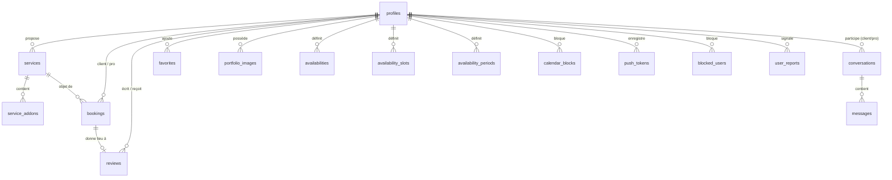

# Base de données — AlloLokal

Base **PostgreSQL** hébergée par Supabase. Toutes les tables applicatives ont **Row Level Security (RLS)** activée : le front-end utilise la clé `anon` et n'accède qu'aux lignes autorisées par les policies. Les Edge Functions utilisent la `service_role` (contourne RLS) pour les opérations privilégiées.

> **Note sur les migrations.** Les tables « historiques » (`profiles`, `services`, `bookings`, `reviews`, `favorites`, `availabilities`, `availability_slots`, `service_addons`, `portfolio_images`, `calendar_blocks`) ont été créées via le SQL Editor Supabase avant l'adoption des migrations versionnées. Le dossier [`supabase/migrations/`](../supabase/migrations/) contient surtout des `ALTER TABLE` et l'ajout des tables plus récentes. Ce document décrit le schéma **tel qu'utilisé par le code** ; la source de vérité complète reste la base distante. Un `supabase db pull` permettrait de reconstituer un schéma complet versionné.

---

## 1. Diagramme entité-relation

---

## 2. Tables principales

### `profiles`
Profil utilisateur (client **et** pro — le rôle distingue). Lié à `auth.users`.

| Colonne                                | Type          | Notes                                                        |
| -------------------------------------- | ------------- | ------------------------------------------------------------ |
| `id`                                   | uuid (PK)     | = `auth.users.id`                                            |
| `role`                                 | text          | `client` \| `pro` (rôle applicatif)                          |
| `stripe_connect_id`                    | text          | Compte Stripe Connect Express du pro                         |
| `onboarding_complete`                  | boolean       | Passé à `true` par le webhook Stripe `account.updated`       |
| `subscription_tier`                    | text          | `essential` \| `flex` \| `plus` (défaut `essential`)         |
| `show_on_map`                          | boolean       | Affichage sur la carte publique (défaut `false`)             |
| `store_name`                           | text          | Nom de la boutique                                           |
| `latitude`, `longitude`                | double        | Position (carte, recherche par distance)                     |
| `is_suspended` / `suspended`           | boolean       | Suspension admin (synchronisées par migration)               |
| identité, e-mail, téléphone            | text          | Ajoutés via migrations `add_identity_fields`, `add_email_fields`, `add_phone_to_profiles` |
| horodatages suspension/suppression     | timestamptz   | `add_suspension_deletion_timestamps`                         |

> Le rôle **admin** n'est pas dans `profiles` mais dans `auth.users.app_metadata.role` (porté par le JWT).

### `services`
Prestation proposée par un pro (catégorie, prix, description, traductions).

| Colonne        | Type        | Notes                                              |
| -------------- | ----------- | -------------------------------------------------- |
| `id`           | uuid (PK)   |                                                    |
| `pro_id`       | uuid (FK)   | → `profiles.id`                                    |
| `category`     | text        | Slug de catégorie (normalisé, voir migrations)     |
| `price`        | numeric     |                                                    |
| traductions    | jsonb/text  | `add_service_translations`                         |

### `service_addons`
Options/suppléments rattachés à un service (FK `service_id`).

### `bookings`
Réservation d'une prestation. Table centrale du cycle de vie + litiges.

| Colonne                                    | Type        | Notes                                                       |
| ------------------------------------------ | ----------- | ----------------------------------------------------------- |
| `id`                                       | uuid (PK)   |                                                             |
| `client_id`, `pro_id`                      | uuid (FK)   | → `profiles.id`                                             |
| `service_id`                               | uuid (FK)   | → `services.id`                                             |
| `status`                                   | text        | `pending` → `confirmed` → `completed` \| `disputed` \| …    |
| `dispute_reason`, `disputed_at`, `disputed_by` | text/ts/uuid | Ouverture de litige (côté client)                       |
| `dispute_resolution`                       | text        | `client_won` \| `pro_won` \| `closed`                       |
| `dispute_admin_note`, `dispute_resolved_at`, `dispute_resolved_by` | | Résolution (côté admin)                        |

Index partiel `idx_bookings_disputed` sur `(status, disputed_at)` pour la page admin des litiges.

### `reviews`
Avis laissé après une réservation (note + commentaire). FK vers `profiles` (auteur/cible) et `bookings`.

### `favorites`
Pros/services mis en favori par un client (FK `profiles`).

### `portfolio_images`
Images du portfolio d'un pro (stockage dans le bucket `portfolio`).

---

## 3. Disponibilités & agenda

| Table                  | Rôle                                                                       |
| ---------------------- | -------------------------------------------------------------------------- |
| `availabilities`       | Disponibilités récurrentes (horaires hebdomadaires) du pro                 |
| `availability_slots`   | Créneaux de disponibilité                                                   |
| `availability_periods` | Périodes datées avec type de lieu (`home` \| `store` \| `both`)            |
| `calendar_blocks`      | Jours/plages bloqués manuellement par le pro                               |

`availability_periods` : lecture publique (`anon` + `authenticated`), écriture réservée au pro propriétaire (`pro_id = auth.uid()`).

---

## 4. Messagerie & modération (contenu utilisateur)

### `conversations`
Une conversation **unique** par couple (`client_id`, `pro_id`). Champs dénormalisés `last_message` / `last_message_at` maintenus par trigger. **Realtime activé.**

### `messages`
| Colonne           | Type        | Notes                                             |
| ----------------- | ----------- | ------------------------------------------------- |
| `conversation_id` | uuid (FK)   | → `conversations.id`                              |
| `sender_id`       | uuid (FK)   | → `profiles.id`                                   |
| `content`         | text        | `CHECK` : 1–2000 caractères                       |
| `read_at`         | timestamptz | `NULL` = non lu                                   |

**RLS** : seuls les deux participants lisent/écrivent ; seul le destinataire peut marquer comme lu. **Realtime activé.**

### `blocked_users`
Blocage utilisateur (unique par couple `blocker_id`/`blocked_id`). Chacun gère ses propres blocages et peut voir s'il a été bloqué.

### `user_reports`
Signalements. `status` : `open` \| `reviewed` \| `dismissed`. FK optionnelle vers `conversation_id`.
> ⚠️ Pas encore d'interface admin pour consulter `user_reports` — à construire.

### `consent_logs`
Traçabilité du consentement CGU/CGV à l'inscription (**obligation légale**). FK vers `auth.users`. RLS = `service role only` (`USING (false)`) : aucun accès direct client, écriture par Edge Function uniquement.

### `push_tokens`
Tokens FCM par utilisateur (`platform` : `android` \| `ios`). Unique par `(user_id, token)`. RLS : chacun ne gère que ses tokens.

---

## 5. Fonctions Postgres (RPC) & triggers

| Fonction                                | Rôle                                                                 |
| --------------------------------------- | ------------------------------------------------------------------- |
| `get_services_with_distance(...)`       | Recherche de services triés par distance (haversine)                |
| `get_next_available_dates(...)`         | Prochaines dates disponibles d'un pro                               |
| `get_available_pro_ids_in_range(...)`   | Pros disponibles dans une plage de dates                            |
| `update_conversation_last_message()`    | Trigger : met à jour `last_message` sur `conversations`             |
| `handle_booking_disputed()`             | Trigger : met en pause à l'ouverture d'un litige                    |
| `trigger_send_welcome()`                | Trigger : déclenche l'e-mail de bienvenue                           |

---

## 6. Storage (buckets)

| Bucket      | Contenu                          |
| ----------- | -------------------------------- |
| `avatars`   | Photos de profil                 |
| `portfolio` | Images de portfolio des pros     |

---

## 7. Conventions RLS

- **Propriété** : `USING (<colonne_owner> = auth.uid())` — un utilisateur n'agit que sur ses lignes.
- **Participants** : accès conditionné par un `EXISTS` sur la table de liaison (messagerie).
- **Admin** : policies dédiées `Admins can view/update all …` conditionnées au rôle admin.
- **Lecture publique ciblée** : profils affichés sur la carte, périodes de disponibilité.
- **Service-role-only** : `consent_logs` (aucun accès client).
